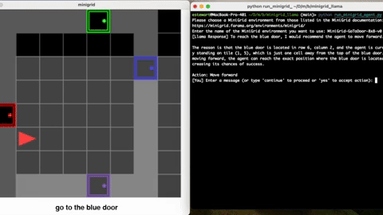

# Gridworld Agent Supervisor

This repository implements a framework for human-in-the-loop interaction with LLM agents in Minigrid environments. The system allows users to interact with an agent embodied in a gridworld environment. For example, users can supervise an agent on difficult tasks or propose new instructions to the agent, making it a useful testbed for human-AI collaboration.
<div align="center">
  
</div>

## Features
- **Interactive Gridworld Environment:** Navigate any supported Minigrid environment (e.g., `MiniGrid-GoToDoor-8x8-v0`) rendered in real-time.
- **LiteLLM Integration:** Swap to any LLM provider supported by LiteLLM (Ollama + LLama 3.2:3B by default)
- **Human-in-the-loop:** The LLM will interpret the grid descriptions, generate actions, and provide reasoning for its choices. Interact dynamically with the LLM to ask clarifying questions, provide corrections, or accept/reject the suggested actions.
- **Runs on your laptop!:** Tested on a 2023 Macbook Pro with an M3 Pro chip and 36 GB of memory.

## Installation

### Prerequisites
- Python 3.8 or higher
- [Gymnasium](https://github.com/Farama-Foundation/Gymnasium) and [Minigrid](https://github.com/Farama-Foundation/Minigrid)
- Llama 3.2:3b server accessible at `http://localhost:11434/api/v1/chat`. See the section below on how to set up Llama with Ollama.

### Steps
1. Clone this repository:
   ```bash
   git clone https://github.com/estewart987/gridworld-agent-supervisor.git
   cd gridworld-agent-supervisor
   ```

2. Create a virtual environment and install dependencies:
   ```bash
   python -m venv venv
   source venv/bin/activate
   pip install -r requirements.txt
   ```

3. Start the Llama server:
   ```bash
   ollama serve
   ```
   By default, the server runs on `http://localhost:11434`. If you need to specify a different port, you can do so with:
   ```bash
   ollama serve --port 11434
   ```
   Confirm the server is running by visiting `http://localhost:11434/api/v1/chat` in your browser or using a tool like curl:
   ```bash
   curl http://localhost:11434/api/v1/chat -X POST -d '{"model": "llama", "prompt": "Hello"}'
   ```

4. Install Minigrid:
   ```bash
   pip install gym-minigrid
   ```

5. Verify installation:
   ```bash
   python run_minigrid_agent.py
   ```

## Usage

### Run the Agent
To start the interaction with the Minigrid environment, execute:
```bash
python run_minigrid_agent.py
```
You will be prompted to enter a MiniGrid environment from those listed at `https://minigrid.farama.org/environments/minigrid/`

### How It Works
1. **Environment Initialization:** The agent is placed in a Minigrid environment with a random initial state.
2. **Grid Description:** The environment is translated into a human-readable format, which includes descriptions of each tile (e.g., `A red agent that is facing right`).
3. **LLM Interaction:** The agent queries the LLM to determine the next action based on the current grid state and mission.
4. **Dynamic User Interaction:** Users can interact with the LLM to clarify or modify the suggested action before it is executed in the environment.
5. **Action Execution:** The chosen action is executed, and the grid is updated in real time.
6. **Completion:** The process repeats until the task is completed or the environment terminates.

### User Input Commands
- **`yes`:** Accept the LLM's suggested action and proceed.
- **`continue`:** Skip further interaction and move forward.
- **Any other input:** Engage in conversation with the LLM to ask clarifying questions or provide feedback.

## Setting Up Llama with Ollama
#### Prerequisites
Before proceeding, ensure the following are installed:
1. **Docker**: [Download and install Docker](https://www.docker.com/get-started) if you haven’t already.
2. **Ollama CLI**: [Download the Ollama CLI](https://ollama.com/) to manage and run models.

#### Step 1: Install Ollama
1. Follow the instructions on the [Ollama website](https://ollama.com/) to download and install the CLI tool for your operating system.
2. After installation, verify that the CLI is working by running:
   ```bash
   ollama help
   ```
   This should display a list of available commands.

#### Step 2: Pull the Llama Model
Use the Ollama CLI to download the Llama model:
```bash
ollama pull llama
```

#### Step 3: Verify the Llama Model
Check if the Llama model is successfully installed:
```bash
ollama list
```
The `llama` model should appear in the list of available models.

#### Step 4: Run the Llama Model
Start a session with the Llama model by running:
```bash
ollama run llama
```
You can now interact with the Llama model directly in your terminal.

#### Troubleshooting
- If you encounter issues with Docker, ensure it's running and properly configured.
- If the Ollama CLI doesn’t recognize commands, verify the installation path and that it’s added to your system's `PATH` variable.

For more details about using Ollama, refer to the [official documentation](https://ollama.com/docs).

## Future Enhancements
- Support BabyAI environments.
- Integrate other LLMs for broader functionality.
- Add logging and metrics for tracking LLM performance and decision accuracy.

## License
This project is licensed under the MIT License. See `LICENSE` for details.

## Acknowledgments
- [Minigrid](https://github.com/Farama-Foundation/Minigrid)
- [Llama 3.2:3b](https://ollama.ai/)